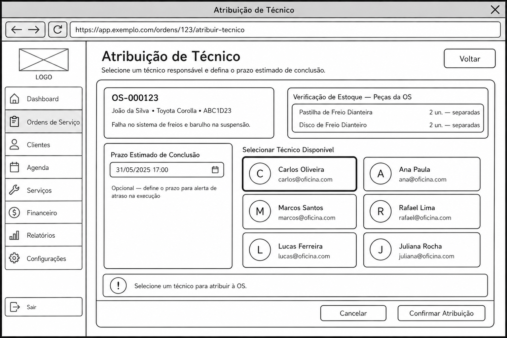
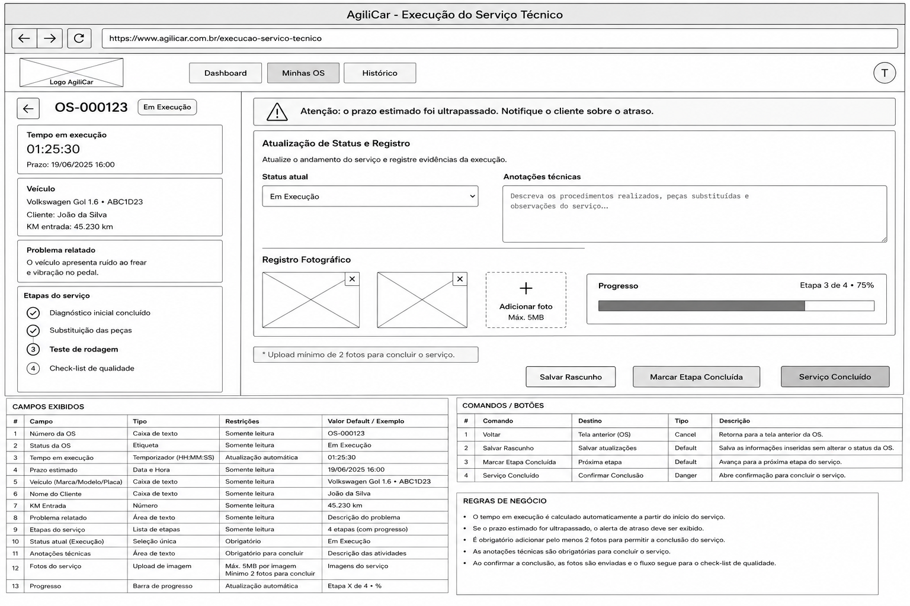
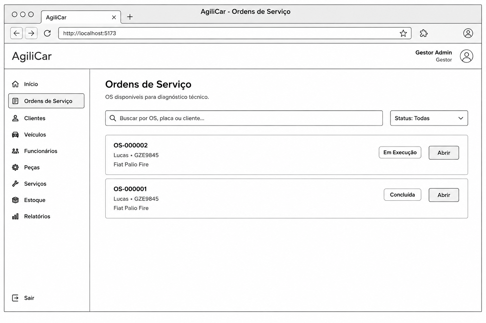

### 3.3.3 Processo 3 – Controle de Status da Ordem de Serviço

O Processo 3 tem como objetivo acompanhar a execução da Ordem de Serviço após a aprovação do orçamento, controlando a atribuição de técnicos, o andamento da manutenção e o monitoramento dos prazos estabelecidos.

Atualmente, o acompanhamento da execução dos serviços pode ocorrer por meio de comunicação verbal e registros descentralizados, dificultando o monitoramento do progresso e a identificação de atrasos.

Com a utilização do sistema AgiliCar, todas as etapas da execução passam a ser registradas digitalmente, permitindo atualização em tempo real, acompanhamento dos responsáveis, registro de evidências fotográficas e monitoramento automático dos prazos.

#### Início do Processo

O processo inicia após a aprovação do orçamento pelo cliente e a liberação da Ordem de Serviço para execução.

#### Participantes

- Gestor da Oficina;
- Técnico/Mecânico;
- Sistema AgiliCar.

#### Atividades do Processo

1. Receber a Ordem de Serviço aprovada;
2. Atribuir técnico responsável;
3. Iniciar execução do serviço;
4. Atualizar status da OS;
5. Registrar anotações técnicas;
6. Registrar evidências fotográficas;
7. Monitorar progresso;
8. Controlar tempo de execução;
9. Monitorar atrasos;
10. Concluir serviços;
11. Encaminhar para controle de qualidade.

#### Fim do Processo

O processo é encerrado quando todos os serviços previstos na Ordem de Serviço são executados e a OS é encaminhada para a etapa de controle de qualidade.

#### Oportunidades de Melhoria

- Controle em tempo real da execução da OS;
- Distribuição eficiente das atividades entre técnicos;
- Registro digital do progresso do serviço;
- Armazenamento de evidências fotográficas;
- Monitoramento automático de atrasos;
- Rastreabilidade completa das etapas executadas.

---

## Detalhamento das atividades

### Verificar Disponibilidade de Peças

| Campo                      | Tipo           | Restrições                 | Valor Default |
| -------------------------- | -------------- | -------------------------- | ------------- |
| Número da OS               | Caixa de texto | Somente leitura            | Sistema       |
| Lista de Peças Necessárias | Tabela         | Somente leitura            | Sistema       |
| Quantidade Disponível      | Número         | Somente leitura            | Estoque       |
| Status de Disponibilidade  | Seleção única  | Disponível ou Indisponível | Sistema       |

| Comandos                  | Destino                            | Tipo    |
| ------------------------- | ---------------------------------- | ------- |
| Confirmar Disponibilidade | Atribuição Técnica                 | default |
| Atualizar Estoque         | Verificar Disponibilidade de Peças |         |

---

### Atribuição Técnica

| Campo               | Tipo          | Restrições                  | Valor Default |
| ------------------- | ------------- | --------------------------- | ------------- |
| Técnico Responsável | Seleção única | Técnicos cadastrados        |               |
| Prazo Estimado      | Data          | Obrigatório                 |               |
| Prioridade          | Seleção única | Baixa, Média, Alta, Urgente | Média         |
| Observações         | Área de texto | Opcional                    |               |

| Comandos          | Destino                            | Tipo    |
| ----------------- | ---------------------------------- | ------- |
| Verificar Estoque | Verificar Disponibilidade de Peças | Sistema |
| Atribuir          | Execução do Serviço                | default |

---

### Execução do Serviço

| Campo               | Tipo           | Restrições                       | Valor Default |
| ------------------- | -------------- | -------------------------------- | ------------- |
| Número da OS        | Caixa de texto | Somente leitura                  | Sistema       |
| Técnico Responsável | Caixa de texto | Somente leitura                  | Sistema       |
| Status da Execução  | Seleção única  | Em andamento, Pausado, Concluído | Em andamento  |
| Horário de Início   | Data e Hora    | Automático                       | Sistema       |
| Tempo Decorrido     | Número         | Automático                       | Sistema       |

| Comandos         | Destino               | Tipo    |
| ---------------- | --------------------- | ------- |
| Atualizar Status | Atualização de Status |         |
| Concluir Serviço | Fim do Processo 3     | default |

---

### Atualização de Status

| Campo                | Tipo          | Restrições  | Valor Default |
| -------------------- | ------------- | ----------- | ------------- |
| Descrição da Etapa   | Área de texto | Obrigatório |               |
| Fotos do Serviço     | Arquivo       | JPG ou PNG  |               |
| Observações Técnicas | Área de texto | Opcional    |               |
| Data da Atualização  | Data e Hora   | Automático  | Sistema       |

| Comandos      | Destino               | Tipo    |
| ------------- | --------------------- | ------- |
| Capturar Foto | Atualização de Status |         |
| Salvar Etapa  | Execução do Serviço   | default |

---

### Monitoramento da Ordem de Serviço

| Campo            | Tipo          | Restrições                 | Valor Default |
| ---------------- | ------------- | -------------------------- | ------------- |
| Tempo Previsto   | Número        | Somente leitura            | Sistema       |
| Tempo Decorrido  | Número        | Somente leitura            | Sistema       |
| Status do Prazo  | Seleção única | Dentro do Prazo, Em Atraso | Sistema       |
| Alertas Emitidos | Área de texto | Somente leitura            | Sistema       |

| Comandos                | Destino                           | Tipo |
| ----------------------- | --------------------------------- | ---- |
| Atualizar Monitoramento | Monitoramento da Ordem de Serviço |      |
| Registrar Alerta        | Execução do Serviço               |      |

---

### WIREFRAMES - PROCESSO 3

