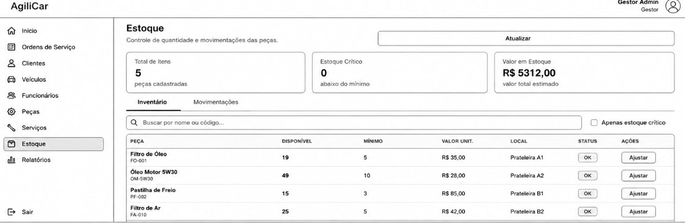
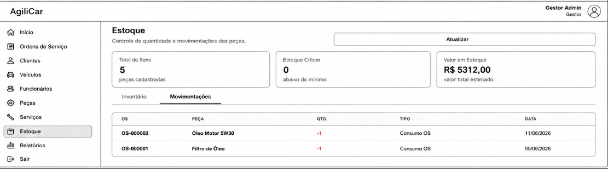

### 3.3.4 Processo 4 – Gestão de Estoque

O processo de Gestão de Estoque Inteligente tem como objetivo controlar a utilização de peças durante a execução das Ordens de Serviço, garantindo rastreabilidade, atualização automática dos custos e monitoramento dos níveis de estoque.

Atualmente, o controle de estoque pode depender de registros manuais e verificações periódicas, aumentando o risco de divergências entre a quantidade física e a quantidade registrada, além de dificultar o planejamento de reposições.

Com a utilização do sistema AgiliCar, as movimentações passam a ser registradas automaticamente, permitindo controle em tempo real das saídas de peças, atualização dos custos das Ordens de Serviço e geração automática de alertas de reposição.

#### Início do Processo

O processo inicia quando uma peça é solicitada para utilização em uma Ordem de Serviço em execução.

#### Participantes

- Técnico/Mecânico;
- Sistema AgiliCar.

#### Atividades do Processo

1. Selecionar peça para a OS;
2. Consultar disponibilidade;
3. Verificar quantidade disponível;
4. Gerar solicitação de reposição quando necessário;
5. Separar peça;
6. Liberar peça;
7. Registrar baixa no estoque;
8. Atualizar custos da OS;
9. Verificar estoque mínimo;
10. Gerar alerta de reposição;
11. Registrar histórico da movimentação.

#### Fim do Processo

O processo é finalizado quando a movimentação da peça é registrada e os custos da Ordem de Serviço são atualizados no sistema.

#### Oportunidades de Melhoria

- Automatização da baixa de estoque após a liberação da peça;
- Atualização automática dos custos da Ordem de Serviço;
- Controle preventivo de reposição através de alertas de estoque mínimo;
- Registro completo do histórico de movimentações para auditoria;
- Integração entre os módulos de Estoque, Ordens de Serviço e Serviços executados;
- Redução de erros manuais no controle de entrada e saída de peças.

---

## Detalhamento das atividades

### Selecionar Peça

| **Campo**             | **Tipo**       | **Restrições**                    | **Valor default** |
| --------------------- | -------------- | --------------------------------- | ----------------- |
| Código da Peça        | Caixa de Texto | Deve existir no cadastro de peças |                   |
| Nome da Peça          | Caixa de Texto | Obrigatório                       |                   |
| Quantidade Solicitada | Número         | Maior que zero                    | 1                 |
| Ordem de Serviço      | Seleção única  | OS deve estar ativa               | OS atual          |

| **Comandos**      | **Destino**       | **Tipo** |
| ----------------- | ----------------- | -------- |
| Buscar Peça       | Consultar Estoque | default  |
| Adicionar Item    | Selecionar Peça   |          |
| Confirmar Seleção | Consultar Estoque | default  |

---

### Consultar Estoque

| **Campo**              | **Tipo**       | **Restrições**                      | **Valor default** |
| ---------------------- | -------------- | ----------------------------------- | ----------------- |
| Quantidade Disponível  | Número         | Somente leitura                     | Valor do sistema  |
| Localização no Estoque | Caixa de Texto | Somente leitura                     | Valor do sistema  |
| Status do Item         | Seleção única  | Disponível / Crítico / Indisponível | Disponível        |

| **Comandos**              | **Destino**                | **Tipo** |
| ------------------------- | -------------------------- | -------- |
| Consultar Disponibilidade | Gateway "Peça disponível?" | default  |
| Atualizar Consulta        | Consultar Estoque          |          |

---

### Liberar Peça

| **Campo**                  | **Tipo**       | **Restrições**                      | **Valor default** |
| -------------------------- | -------------- | ----------------------------------- | ----------------- |
| Item Separado              | Caixa de Texto | Obrigatório                         |                   |
| Quantidade Liberada        | Número         | Não pode exceder estoque disponível |                   |
| Responsável pela Liberação | Seleção única  | Usuário do setor de estoque         | Usuário logado    |

| **Comandos**       | **Destino**       | **Tipo** |
| ------------------ | ----------------- | -------- |
| Liberar Peça       | Registrar Baixa   | default  |
| Cancelar Liberação | Consultar Estoque | cancel   |

---

### Registrar Baixa

| **Campo**                 | **Tipo**    | **Restrições**         | **Valor default**   |
| ------------------------- | ----------- | ---------------------- | ------------------- |
| Quantidade Consumida      | Número      | Obrigatório            | Quantidade liberada |
| Data/Hora da Movimentação | Data e Hora | Gerado automaticamente | Data atual          |

| **Comandos**    | **Destino**      | **Tipo** |
| --------------- | ---------------- | -------- |
| Registrar Baixa | Atualizar Custos | default  |
| Confirmar       | Atualizar Custos | default  |

---

### Atualizar Custos da Ordem de Serviço

| **Campo**            | **Tipo** | **Restrições**             | **Valor default**    |
| -------------------- | -------- | -------------------------- | -------------------- |
| Valor Unitário       | Número   | Obtido do cadastro da peça | Valor cadastrado     |
| Quantidade Utilizada | Número   | Maior que zero             | Quantidade consumida |
| Valor Total          | Número   | Calculado automaticamente  | Valor calculado      |

| **Comandos**     | **Destino**              | **Tipo** |
| ---------------- | ------------------------ | -------- |
| Atualizar Custos | Verificar Estoque Mínimo | default  |
| Salvar           | Verificar Estoque Mínimo | default  |

---

### Verificar Estoque Mínimo

| **Campo**                     | **Tipo** | **Restrições**               | **Valor default** |
| ----------------------------- | -------- | ---------------------------- | ----------------- |
| Quantidade Atual              | Número   | Somente leitura              | Valor atualizado  |
| Quantidade Mínima Configurada | Número   | Definida no cadastro da peça | Valor cadastrado  |

| **Comandos** | **Destino**         | **Tipo** |
| ------------ | ------------------- | -------- |
| Gerar Alerta | Registrar Histórico | default  |
| Ignorar      | Registrar Histórico |          |

---

### Registrar Histórico

| **Campo**            | **Tipo**       | **Restrições**           | **Valor default** |
| -------------------- | -------------- | ------------------------ | ----------------- |
| Tipo de Movimentação | Seleção única  | Entrada / Saída / Ajuste | Saída             |
| Usuário Responsável  | Caixa de Texto | Gerado automaticamente   | Usuário logado    |
| Data/Hora            | Data e Hora    | Gerado automaticamente   | Data atual        |

| **Comandos**        | **Destino**     | **Tipo** |
| ------------------- | --------------- | -------- |
| Registrar Histórico | Fim do Processo | default  |
| Finalizar           | Fim do Processo | default  |

---

### Solicitação de Reposição (Fluxo Alternativo)

| **Campo**             | **Tipo**       | **Restrições** | **Valor default** |
| --------------------- | -------------- | -------------- | ----------------- |
| Código da Peça        | Caixa de Texto | Obrigatório    |                   |
| Nome da Peça          | Caixa de Texto | Obrigatório    |                   |
| Quantidade Necessária | Número         | Maior que zero |                   |
| Motivo da Solicitação | Área de Texto  | Obrigatório    | Falta de estoque  |

| **Comandos**        | **Destino**       | **Tipo** |
| ------------------- | ----------------- | -------- |
| Solicitar Reposição | Fim do Processo   | default  |
| Cancelar            | Consultar Estoque | cancel   |

---

### Alerta de Estoque Crítico

| **Campo**         | **Tipo**       | **Restrições**                 | **Valor default** |
| ----------------- | -------------- | ------------------------------ | ----------------- |
| Nome da Peça      | Caixa de Texto | Somente leitura                |                   |
| Quantidade Atual  | Número         | Somente leitura                |                   |
| Quantidade Mínima | Número         | Somente leitura                |                   |
| Status do Alerta  | Seleção única  | Crítico / Reposição Necessária | Crítico           |

| **Comandos** | **Destino**         | **Tipo** |
| ------------ | ------------------- | -------- |
| Gerar Alerta | Registrar Histórico | default  |
| Fechar       | Registrar Histórico |          |

---

### WIREFRAMES - PROCESSO 4

